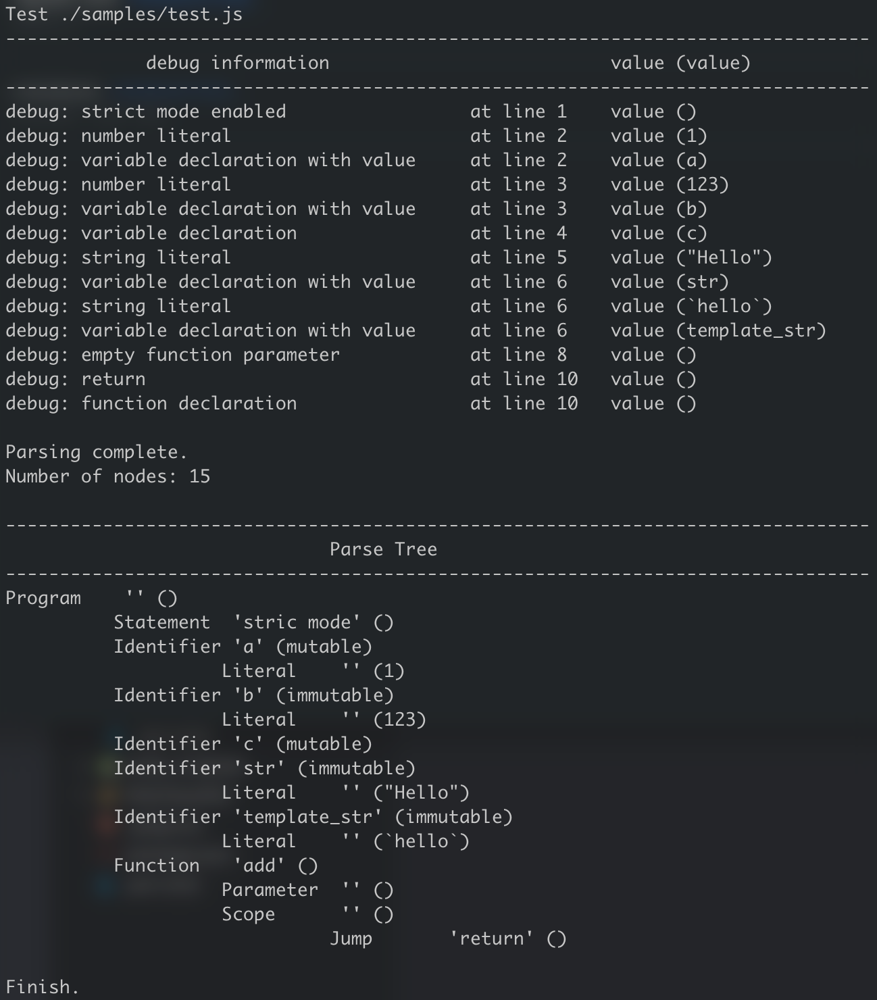

# mini-javascript

A mini JavaScript parser using Lex & Yacc. This parser is not production ready version. So it does not support full syntax of JavaScript and might have potential syntax issue.

## Supported Keywords

It supports most used keywords in JavaScript.

| category                  | keywords                                                         |
|---------------------------|------------------------------------------------------------------|
| variable declaration      | `var`, `let`, `const`                                            |
| function declaration      | `function`, `=>`                                                 |
| loop statements           | `for`, `while`, `do`                                             |
| conditional statement     | `if`, `else`, `switch`, `case`                                   |
| literal                   | `true`, `false`, `null`, `undefined`, `NaN`, `Infinity` and more |
| modern javascript keyword | `"use strict";`, `async`, `await`                                |
| logical operator          | `==`, `===`, `!=`, `!==`, `<`, `>`, `&&`, `\|\|` and more        |
| comment                   | `//`                                                             |

You can find the entire keywords in [this file](./mini-javascript.l).

## Supported Syntax

see [this yacc file](./mini-javascript.y).

## Parse Result

When the parser task ends, it prints debug messages and parse tree as the result.

Here is the sample output:



## Prerequisites

- flex
- bison
- make
- gcc

## Setup

```sh
# compile all sources
$ make

# or you can compile lexer separately
$ ./lex.sh

# NOTE: if you can't run .sh file, run this command first
$ chmod +x *.sh
```

## Usage

```sh
$ ./javascript [FILE]
```

## Test

```sh
$ ./test.sh
```

## Author

- [Jaewook Ahn](https://github.com/Jaewoook)

## License

[MIT License](./LICENSE)